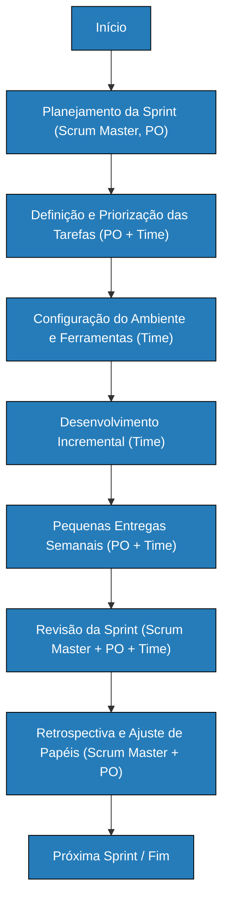

# Processo Ágil Simplificado

Este repositório contém documentação e recursos sobre um processo ágil simplificado para desenvolvimento de software, inspirado no Scrum e conceitos de DevOps.

## 📋 Como Costuma Ser Nosso Processo

O processo atual segue práticas ágeis inspiradas no **Scrum** e conceitos de **DevOps**.
### 🔄 Estrutura das Entregas
- **Grandes sprints** com papéis fixos
- **Pequenas entregas intermediárias** para promover entregas incrementais e feedback constante
- **Reuniões de acompanhamento semanais** (substituindo reuniões diárias)
- **Checkpoints adicionais** nas transições entre grandes sprints

### Organização da Equipe
- **Papéis estáveis** dentro de cada grande sprint
- **Ajustes de papéis** ao final de cada sprint para aumentar a versatilidade da equipe
- Time conta com **Scrum Master** e **Product Owner (PO)**

## Diagrama de Atividades (Ciclo de Vida)

## Descrição das Atividades

| Atividade | Descrição |
|-----------|-----------|
| **Planejamento da Sprint** | Definir objetivos e entregas para o período, confirmando papéis |
| **Definição e Priorização das Tarefas** | PO organiza backlog e prioriza com apoio do time |
| **Configuração do Ambiente e Ferramentas** | Ajustar repositórios e recursos necessários |
| **Desenvolvimento Incremental** | Implementação gradual das funcionalidades planejadas |
| **Pequenas Entregas Semanais** | Apresentar o que foi desenvolvido para obter feedback rápido |
| **Retrospectiva e Ajuste de Papéis** | Identificar melhorias e, se necessário, redefinir papéis entre sprints |

## Papéis e Responsabilidades

### Scrum Master
- Facilita reuniões semanais
- Ajuda a remover impedimentos
- Garante uso de práticas ágeis

### Product Owner (PO)
- Define e prioriza backlog
- Valida entregas
- Representa os interesses do cliente

### Time de Desenvolvimento
- Constrói as funcionalidades
- Prepara ambientes
- Realiza as entregas

## Práticas Ágeis Aplicadas

- **Scrum**: Estrutura de sprints, reuniões semanais, revisão e retrospectiva
- **Feedback Contínuo**: Pequenas entregas para ajustes rápidos
- **Rotatividade de Papéis**: Alterações entre grandes sprints para ampliar habilidades

## Indicação de práticas ágeis a serem aplicadas nas atividades

### Novo Papel: Monitor
- Acompanhar execução
- Monitorar qualidade e cumprimento de prazos
- Atribuir métricas de desempenho

### Melhorias Técnicas

#### Testes Automatizados Contínuos
Garantir qualidade constante com execução automática de:
- Testes unitários
- Testes de integração
- Testes funcionais

#### Implantação Contínua (CD)
- Publicar funcionalidades de forma automatizada e segura em produção

#### Integração Contínua (CI) Mais Robusta
- Reforçar a automação de builds
- Melhorar integração de código

### Sistema de Métricas
- **Avaliação de Tarefas com Métricas**: Sistema de pontuação para medir qualidade, prazo e complexidade das entregas

### Ferramentas DevOps Avançadas
- Integrar monitoramento
- Implementar alertas
- Adicionar automações mais avançadas ao processo

## 📖 Documentação

Esta documentação está disponível como GitHub Pages em: https://btwgio.github.io/processo-agil-simplificado/

